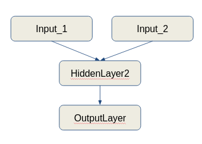

# Data Science Hacks, Tips and Tricks
Data Science Hacks is created and maintained by Analytics Vidhya for the data science community. 

It includes a variety of tips, tricks and hacks related to data science, machine learning 

These Hacks are for all the data scientists out there. It doesn’t matter if you are a beginner or an advanced professional, these hacks will definitely make you efficient!

Feel free to contribute your own data science hacks here. Make sure that your hack follows the [contribution guidelines](/CONTRIBUTING.md)

> This repository is part of the free course by [Analytics Vidhya](https://www.analyticsvidhya.com/). To learn more of such awesome hacks visit [Data Science Hacks, Tips and Tricks](https://courses.analyticsvidhya.com/courses/data-science-hacks-tips-and-tricks)

- ### Data Science Hack #1 - Resource Downloader 
How can you extract image data directly from chrome in one click?
Imagine that you want to make your own machine learning project but you don't have enough data, it becomes a daunting task
Worry not you can use the ResourceSaver extension to directly download data! Let's see how!

Steps:
1. Install the chrome extension from the given URL.
1. Go to Google Images or any webpage from where you want to save the data.
1. Open Inspect Element and click to ResourceSaver Tab
1. Click on the button Save All Resources and a zip file will be created.
1. Unzip the file and open folder encrypted-tbn0.gstatic.com
1. You can find the images here.
 
- ### [Data Science Hack #2 Pandas Apply](./Code/Pandas%20Apply.ipynb) 
Pandas Apply is one of the most commonly used functions for playing with data and creating new variables. It returns some value after passing each row/column of a data frame with some function. The function can be both default or user-defined. 

- ### [Data Science Hack #3 Pandas Boolean Indexing](./Code/Pandas_boolean%20indexing.ipynb) 
It helps to select subset of data based on the value of the data in the dataframe

- ### [Data Science Hack #4 Pandas Pivot Table](./Code/pandas_pivot_table.ipynb) 
It is used to create MS Excel style spreadsheet. Levels in the pivot table will be stored in MultiIndex objects (hierarchical indexes) on the index and columns of the result DataFrame.

- ### [Data Science Hack #5 Pandas crosstab](./Code/pandas_crosstab.ipynb) 
pd.crosstab() function is used to get an initial “feel” (view) of the data.

- ### [Data Science Hack #6 Pandas str.split](./Code/first%20and%20last%20name%20extraction.ipynb) 
It is used to apply vectorized string functions on a pandas dataframe column.
Let’s say you want to split the names in a dataframe column into first name and last name.
pandas.Series.str along with split( ) can be used to perform this task.

- ### [Data Science Hack #7 Extract E-mails from text](./Code/Extract%20E-mails%20from%20text.ipynb) 
Here is an interesting hack to extract email ids present in long pieces of text by just using 2 lines of code in Python using regular expressions. Extracting information from social media posts and websites has become a common practice in data analytics but sometimes we end up trying complicated methods to achieve things that can be solved easily by using the right technique. 

- ### [Data Science Hack #8 Normal Distribution](./Code/Convert%20normal%20Distribution.ipynb)
One of the most important assumptions in linear and logistic regression is that our data must follow a normal distribution but we all know that's usually not the case in real life. We often need to transform our data into normal/ gaussian distribution.
 
- ### [Data Science Hack #9 Remove Emojis from text](./Code/Removing%20emojis%20from%20text.ipynb)
Preprocessing is one of the key steps for improving the performance of a model. 
One of the main reasons for text preprocessing is to remove unwanted characters from text like punctuation, emojis, links and so on which is not required for our problem statement. 

- ### Data Science Hack #10 Elbow method for classifier
Elbow Method is used for identifying the value of k in k-Nearest Neighbors. It's a plot of errors at different values of k and we select the k value having least error!

- ### Data Science Hack #11 MinMax Scaler
An important part of data analysis is to preprocessing. Many times we need to scale our features like in the case of k-NN we always need to scale the data before building model or else it'll give spurious results.

- ### [Data Science Hack #12 Feature engineering for time series data](.Code/Hack%20of%20the%20day%20-%20Time%20series.ipynb)
Most of the data collected today, hold the date and time variables. There is a lot of information that you can extract from these features and you can utilize it in your analysis! 

- ### [Data Science Hack #13 Dummy data for linear regression](./Code/make_regression.ipynb)
Deeplearning models usually require a lot of #data for training. But acquiring massive amounts of data comes with its own challenges. Instead of spending days manually collecting data, you can make use of Image Augmentation techniques. It is the process of generating new images. These new images are generated using the existing training images and hence we don’t have to collect them manually.

- ### [Data Science Hack #14 HuggingFace Tokenization](./Code/av_hack.ipynb)
Tokenization is the primary task while building the vocabulary. 
HuggingFace recently created a library for tokenization which provides an implementation of today's most used tokenizers, with a focus on performance and versatility.
Key features:
Ultra-fast: They can encode 1GB of text in ~20sec on a standard server's CPU

- ### [Data Science Hack #15 Divide Continuous and categorical data](./Code/select_dtype.ipynb)
You can extract categorical and numeric features into seperate dataframes in just 1 line of code! 
This can be done using the select_dtypes function.

- ### [Data Science Hack #16 Pandas Profiling](./Code/pandas%20profiling.ipynb)
Do you want to to do perform quick data analysis on your dataframe? 
You can use pandas profiling to generate profile report of your dataset in just 1 line of code!

- ### [Data Science Hack #17 Formatting of DataFrame](./Code/melt().ipynb)
Convert wide form dataframe into long form dataframe in just 1 line of code!
In pd.melt(), one more columns are used as identifiers. "Unmelt the data", use pivot() function

- ### [Data Science Hack #18 Magic Function- %history](./Code/HoD_history.ipynb)
Do you know how you can get the history of all the commands running inside your jupyter notebook?
Use %history, jupyter notebook's built-in magic function! 
Note - Even if you have cut the cells in your notebook, %history will print those commands as well!

- ### [Data Science Hack #19 Heatmap on pandas dataframe](./Code/Styling%20pandas.ipynb)
Create heatmap on pandas dataframe using seaborn!
It helps you understand the complete range of values at a glimpse.

- ### [Data Science Hack #20 Plot confusion matrix](./Code/plot_confusion_matrix.ipynb)
Scikit-learn has released its stable 0.22.1 version with new features and bug fixes.
One new function is the plot_confusion_matrix function which generates an extremely intuitive and customisable confusion matrix for your classifier.
Bonus tip: You can specify the format of the numbers appearing in the boxes using the values_format parameter('n' for whole numbers, '.2f' for float, etc)

- ### [Data Science Hack #21 Ipython Interactive shell](./Code/interactive_notebook.ipynb)
What will be the output if you run the following commands in single cell of your jupyter notebook?
df.shape
df.head()
Ofcourse it'll be first five rows of your dataframe. Can we get output of both the command run in same cell? 
You can do it using InteractiveShell.

- ### Data Science Hack #22 Python tqdm
Most of you have heard about the library tqdm and you might be using it track the progress of forever running for loops. Most of the times we write complex functions having nested for loops. #tqdm allows tracking that too. Here is how you can track the nested loops using tdqm in python.

- ### [Data Science Hack #23 Image Augmentation](./Code/Image%20Augmentation%20-%20Article%20Shoot.ipynb)
Deeplearning models usually require a lot of data for training. But acquiring massive amounts of data comes with its own challenges. Instead of spending days manually collecting data, you can make use of Image Augmentation techniques. It is the process of generating new images. These new images are generated using the existing training images and hence we don’t have to collect them manually.

- ### Data Science Hack #24 Setup Dark Jupyter Notebook Theme
[jupyter-themes](https://github.com/dunovank/jupyter-themes) provides an easy way to change theme, fonts and much more in your jupyter notebook. 

Steps - 

1. Install jupyter-themes -
   - using anaconda 
<code>conda install -c conda-forge jupyterthemes</code>

   - using pip 
<code>pip install jupyterthemes</code>

2. Check list of themes - 
<code> jt - l</code>

3. Select a theme 
<code>jt -t chesterish</code>

4. To restore to default theme - 
<code>jt -r</code>
 

- ### Data Science Hack #25 Change cell width in jupyter notebook
To do this we use jupyter-themes, it provides an easy way to change theme, fonts and much more in your jupyter notebook.

Steps -
1. Install jupyter-themes -
   - using anaconda 
<code>conda install -c conda-forge jupyterthemes</code>

   - using pip 
<code>conda install -c pip install jupyterthemes</code>

2. Change the theme, cell width, cell height 
<code>jt -t chesterish -cellw 100% lineh 170</code>

- ### [Data Science Hack #26 Parse_dates in read_csv() to change data type to datetime](./Code/read_csv_ParseDate.ipynb)
What do you do when you need to change the data type of a column to DateTime? We can do this directly at the time of reading data using parse_dates argument.

- ### Data Science Hack 27 Share jupyter notebook using nbviewer
You can share your jupyter notebook with non-programmers very easily and the best way to do it is by using [jupyter nbviewer](https://nbviewer.jupyter.org/).
Pro tip - You can use [Binder](https://mybinder.org/) to execute the code from nbviewer on your machine!

- ### [Data Science Hack #28 Plotting Decision Tree](./Code/Decision%20Tree%20Plot.ipynb)
Do you know how to plot a decision tree in just 1 line of code? 
Sklearn provides a simple function plot_tree() to do this task. You can tweak the hyperparameters as per your requirements.

- ### [Data Science Hack #29 Invert Dictionary](./Code/invert_dictionary.ipynb)
Do you know how you can invert a dictionary in python?
Dictionary is a collection which is unordered, changeable and indexed.  It is widely used in day to day programming, and machine learning tasks.

- ### [Data Science Hack #30 Interactive plots using plotly](/Code/interactive%20plot%20-%20plotly.ipynb)
[Cufflinks](https://plot.ly/python/v3/ipython-notebooks/cufflinks/) binds plotly directly to pandas dataframes! Therefore you can make interactive charts without any hassle or long codes.

- ### [Data Science Hack #31 Write python file directly from jupyter notebook cell](./Code/write%20python%20script.ipynb)
This hack is about saving contents of a cell to a .py file using the magic command %%writefile and then running the file in another jupyter notebook using the magic command [%run](./Code/run%20python%20script.ipynb)

- ### [Data Science Hack #32 Pretty-print Data structures](./Code/pretty%20print.ipynb)
Are you getting confused while printing some of the data structures? Worry not, it is very common. 
[pretty-print](https://docs.python.org/3/library/pprint.html) module provides an easy way to print the data structures in a visually pleasing way!

- ### [Data Science Hack #33 Date Parser](./Code/Date%20Parser.ipynb)
This code allows you to convert date of any format into a specified format. Many times, we receive dates of various formats in our data. This hack will help you to convert all those formats into a specified format.

- ### [Data Science Hack #34 Feature Selection using SelectFromModel](./Code/FeatureSelection_SelectFromModel.ipynb)
One of the ways to perform feature selection is by using feature_importance_ attribute of the base estimators. Using SelectFromModel function you can specify the estimator and the threshold for feature_importance_, This hack uses 'mean' as the threshold. You can tweak the threshold to get optimum results. To learn more visit the [documentation](https://scikit-learn.org/stable/modules/generated/sklearn.feature_selection.SelectFromModel.html#sklearn.feature_selection.SelectFromModel)

- ### [Data Science Hack #35 Convert Strings into Characters](./Code/convert_string_to_characters.ipynb)
What could be the easiest way to convert a string to characters?
Here is a simple hack which comes in handy while working with text data
 
- ### [Data Science Hack #36 Resize Image Size](./Code/Resizing%20images.ipynb)
While building an image classification model using deep learning, it is required that all the images should be of same size. However, as the data comes from different sources, images may have different shapes. So, to convert them to same shape, we can use the resize function from open cv. This hack will will help you convert the images of any shape to a specified shape.

- ### [Data Science Hack #37 Apply pandas in parallel](./Code/pandarellel.ipynb)
Does it take time to perform operations on your pandas dataframe? [Pandarallel](https://github.com/nalepae/pandarallel) is a simple and efficient tool to parallelize Pandas operations on all your available CPUs!

- ### [Data Science Hack #38 Generator Expressions vs List comprehension](./Code/generator%20vs%20list.ipynb)
The generator yields one item at a time and generates them only when in demand. Generators are much more memory efficient. This hack compares generator expressions with list comprehensions.

- ### Data Science Hack #39 Test your Regex
Do you avoid regex because they are hard to read and write as well as tricky to get right? This hack helps you get your regex correct.
[regex101](https://regex101.com/) is an online regex tester, debugger with highlighting for PHP, PCRE, Python, Golang and JavaScript

- ### [Data Science Hack #40 Convert List of Lists to List](./Code/list_of_lists_to_list.ipynb)
Sometimes the data can be in the form of nested list. For example, the data can be date-wise transaction records for a particular product. However, you might need only in a single dimension. This hack will help you to flatten the list of lists into a single list.

- ### [Data Science Hack #41 Hide Print Statements](./Code/hide_print.ipynb)
We often use print statements for debugging purposes. This hack will help you to turn off print statements in a particular section of the code so that it will make debugging easier.

- ### [Data Science Hack #42 Split PDF Document page-wise](./Code/split_pdf_pages.ipynb)
This hack will help you to split a single PDF document into multiple pages.

- ### [Data Science Hack #43 Merge PDF Documents](./Code/merge_pdf.ipynb)
This hack will help you to combine multiple PDF documents into a single document. This hack is the inverse of [Hack #42 Split PDF Document page-wise](#data-science-hack-42-split-pdf-document-page-wise)

- ### [Data Science Hack #44 Create a Custom Image DataGenerator in Keras](./Code/CustomDataGen_Keras.ipynb)
Sometimes you would need a functionality which is not directly provided by Keras's ImageDataGenerator. You can easily create a wrapper around it to suit your needs. 

1. For example, your usecase is that you have multi-input Deep Learning model like this

(i.e. a neural network which takes input from multiple data sources, and does a combined training on this data), and you want that the data generator should be able to handle the data preparation on the fly, you can create a wrapper around ImageDataGenerator class to give the required output.[This notebook](./Code/CustomDataGen_Keras.ipynb) explains a simple solution to this usecase. 

2. Another use case could be that you want to resize the images from a shape say 150x150 to a shape 224x224, which is generally utilized by the pretrained models, you can customize the ImageDataGenerator without coding your own data generator from ground up [(Example Notebook)](https://github.com/faizankshaikh/AV_Article_Codes/blob/master/Inception_From_Scratch/improvements/Inception_v1_from_Scratch.ipynb).
